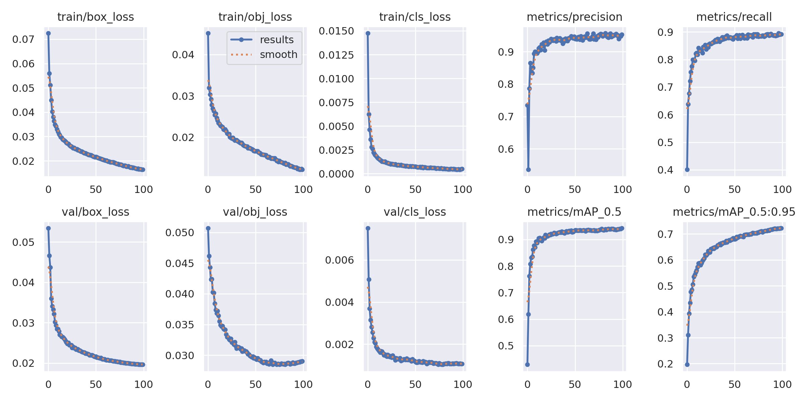

## 1. What I Built

### 1.1 System Architecture

系統的骨架沿用 spec 第 2 頁的方塊圖，但把它從通用示意改成我實際的設計。我從 Virtualizer 內建的 Arm Cortex-R52 Example 出發，把核心數縮到 1 顆，再在旁邊接上 *YOLOv5_HW*、兩塊記憶體與 UART，全部掛在同一條共享匯流排上。

{width=70%}

跟 spec 原圖比，我加了三個東西。第一是 *YOLOv5_HW* 的控制暫存器 `SRC`、`DST`、`START`，這是我自己設計的暫存器介面。第二是從 IP 拉回 CPU 的 INT 中斷線。第三是把每塊的位址都標上去。要特別說明的是，spec 圖畫了兩條匯流排，但我實際上是單一共享匯流排（*SharedmemoryMap*），而且 *YOLOv5_HW* 除了當 slave 被 CPU 寫暫存器之外，還有自己的 initiator socket，能主動去讀 `SRC`、寫 `DST`，也就是它把 DMA 的搬運行為內建在自己身上，所以整張圖不需要用到獨立的 DMA。

### 1.2 Memory Map 與控制暫存器

整個 SoC 的位址空間由 *SharedmemoryMap* 管理，配置如下。

| Block | Start Address-End Address | Size | Purpose | 備注 |
|---|---|---|---|:-:|
| *MEM*（*RAM0*） | 0x00000000–0x01FFFFFF | 32 MB | R52 本地 | 主要放程式碼與內嵌影像 |
| *MEM_1*（*RAM1*） | 0x08000000–0x09FFFFFF | 32 MB | 共享 | 放推論結果 |
| *YOLOv5_HW* | 0x10000000–0x1000000B | 12 B | 控制暫存器 ||
| *UART_0*–*UART_3* | 0x40000000–0x40003FFF | 4 KB each | UART 暫存器 | |
| *ARM0*（AXIS） | 0x50000000–0x50FFFFFF | 16 MB | 核心 slave port | |

控制暫存器只有三個 32-bit，從 0x10000000 起算。`SRC`（0x10000000）放待偵測影像的來源位址，`DST`（0x10000004）放結果要寫回的目的位址，`START`（0x10000008）寫 1 就啟動一次推論。因為影像容器自帶 16-byte 標頭，寬高資訊在裡面，IP 自己就能算出要讀多少 byte，所以達到像 spec 所說的幾乎跟 DMA 一樣，但是少一個 SIZE Controller。

{width=78%}

### 1.3 Bare-metal 控制流程

R52 開機後，*startup_r52.S* 先處理一件 R52 特有的事。它 reset 進的是 Hyp mode（EL2），所以我在啟動碼裡偵測到 Hyp 之後先開好 GIC 系統暫存器的存取，再 `eret` 降到 SVC，CPU 才順利進到 `main`。接著主迴圈對三張影像各做一輪，先寫 `SRC`、`DST`，再寫 `START` = 1 啟動 IP，等 IP 完成後從 *RAM1* 把 `[count][boxes]` 讀回來，再把每個框的座標從 UART 印出。三張都完成後印出 `R52: 3/3 images done` 收尾。

## 2. 訓練 YOLOv5l 與移植進系統

### 2.1 訓練

我在 KITTI 資料集上訓練 YOLOv5l，類別取 *Car*、*Pedestrian*、*Cyclist* 三種交通物件，輸入解析度 640，訓練 100 個 epoch。收斂後在驗證集上的 mAP@0.5 達到 0.943。訓練好的權重再匯出成 ONNX，取 opset 12，輸入形狀 [1, 3, 640, 640]，輸出 [1, 25200, 8]，作為後面 C++ 與 SystemC 端共同的模型格式。

{width=88%}

### 2.2 移植進系統

移植是一條 ONNX → C++ → SystemC → Virtualizer 的路。我先用 ONNX Runtime 在 C++ 端寫了一個純推論核心，並在 Task B 用同一組輸入比對 Python 參考結果，輸出的相對誤差只有 3e-6，確認 C++ 端跟訓練端行為一致之後，才把這個核心包進 *YOLOv5_HW* 這個 SystemC 模組，最後匯入 Virtualizer 建成 TLM。

在資料的擺放上我做了一個務實的取捨。原本的確打算把待測影像放進共享的 *RAM1* 讓 IP 去讀，但結果慢到不行。想了一項，在模型裡用 CPU 把一張約 4MB 的影像逐 byte 搬進去有點太異想天開了。所以為了模擬的效率，以及考量到每個 byte 都是一次匯流排交易，我決定把影像容器直接弄進 ELF 裡，並落在 *RAM0* ，讓 `SRC` 可以直接指到那個位址，不過結果仍寫回 *RAM1* 的 `DST`。

那因為 SoC Lab 裡沒有可用的 OpenCV dependencies ， 這也導致一般的 PNG 沒辦法解碼，而 spec 對影像容器格式也沒有確切說明，所以我決定自訂了一個最小的格式。設計是，標頭為 16-byte 小端序，內容為 magic `0x4D493559`（即 'Y5IM'）、width、height 與 channels = 3，後面接 W×H×3 的 RGB HWC 位元組。IP 的 `preprocess` 會解析這個標頭，再手刻一個保持長寬比的 letterbox 縮放到 640（不足處補 114 灰邊）、除以 255、把 HWC 轉成 CHW，全程不依賴 OpenCV。

{width=72%}

## 3. Roadblocks and How I Got Past Them

### 3.1 卡在 Virtualizer 匯入時的建置

把 SystemC 模組匯入之後，第一次建置就失敗，而且錯誤全發生在 Virtualizer 自動產生的覆蓋率鷹架裡（`covermodelBase.h`），訊息還很怪，是 `expected identifier before '@'`，我自己寫的模組反而編得過。追下去才發現原因。我的模組建構子帶了一個 `const char*` 的模型路徑參數，而 Virtualizer 的 covermodel 產生器對字串參數會吐出一段編不過的包裝碼，後續換成數值參數就解決了。

緊接又遇到 include 路徑的問題。ONNX Runtime 的標頭一直找不到，我一度以為把路徑塞進 Compile Flags 或設好環境變數就好，結果都沒用。原因是匯入時做語法分析的前端跟匯入後建置用的編譯器是兩回事，它不讀 Compile Flags，也不理會繼承來的 `CPLUS_INCLUDE_PATH`，只認 Build > Compiler 底下專門的 Include Paths 欄位，除此之外，用 `-I` 會指到目錄也不是標頭檔本身。甚至編譯階段跟連結階段也是分開的兩件事，編譯要 ORT 的 include 目錄，連結則要 ORT 的函式庫目錄加上函式庫名稱，少了後者就會停在 `undefined reference to OrtGetApiBase`。

### 3.2 中斷極性的修正

我一開始把 INT 腳位寫成 active-LOW，直接沿用了 Project 1 中設計的 DMA2 的 nIRQ 習慣。但 R52 的 GIC 對 Shared Peripheral Interrupt 只吃 rising-edge 或 active-HIGH level，active-LOW 只保留給未配置的 PPI。照 active-LOW 接的話，IP 在閒置時就會被讀成已觸發，中斷會在開機瞬間誤發，反而在完成時清掉，整個邏輯是反的。所以我把 IP 改成完成時把 INT 拉高，並在 distributor 上把 INTID 32 設成 Group 1、active-HIGH level。

### 3.3 中斷送不到 CPU，改用輪詢

此外，在原本的設計裡，IP 沒有 status 暫存器，完成訊號只靠 INT，所以中斷理應是不可或缺的，ISR 也因此是結構上必要的。實際在平台上跑，CPU 卻始終沒進到 ISR。我加了儀器化的 ELF 去追，才找到真正的原因。GIC distributor / redistributor 那段 MMIO 在 R52 的 CPU 匯流排上根本沒有被解碼，每一次對 GIC 暫存器的讀取都會觸發同步 external abort（DFSR `0x1210`），每一次寫入則被靜靜丟掉。相對地，CPU 端的系統暫存器介面是好的，`ICC_SRE` 讀回 `0x7`，我的控制暫存器 0x10000000 也讀得到，所以問題不在我的程式，而在這塊 GIC 區域沒掛上匯流排。之前一度以為 0x13090000 確認可用，後來發現那是透過 Design Browser 直接戳模型的後門，並不是真正的匯流排存取。

隨著 demo 的期限將至，我選擇在當前的 survey 前停下，不繼續往 GIC 裡鑽牛角尖。最後選擇讓 IP 完成時會把 `[count][records]` 寫進 *RAM1* 的 `DST`，那個 count 字本身就可以當完成旗標。CPU 每次啟動前先在 count 字塞一個哨兵值 `0xFFFFFFFF`，再輪詢那個位置，等 IP 把它覆寫成真正的偵測數，就知道完成了，即使偵測數為 0 也看得出來。另外因為 IP 是 `SC_CTHREAD` 綁在時脈邊緣上，而 R52 的時脈只在 CPU 發匯流排交易時才前進，所以我讓完成後再補幾筆對 *RAM1* 的讀取去逼出時脈邊緣，好讓 IP 看到 `START` = 0 而重新武裝。ISR 與 GIC 初始化的程式我仍然保留著，萬一平台哪天真的送出 INTID 32，那條路也是通的。這件事跟 Project 1 意外地遙相呼應，P1 的 A35 nIRQ 也從沒真正送達，最後同樣退回輪詢。或許訊號在介面上接對了，也不代表它真的會被送到， virtualizer 真的很玄妙。

## 4. Final Results

### 4.1 三張影像跑完，結果落在 RAM1

三張測試影像（KITTI 的 002071 / 003379 / 005872，內容都只有車輛）依序跑完，R52 從 *RAM1* 讀回的偵測數分別是 12、4、3 台車。要在 memory viewer 看到這個結果有個關鍵。必須透過 CPU 匯流排的視角看，也就是對 *ARM0* 核心 View Memory 再 Goto 全域的 `DST` 位址，而不是直接看 *MEM_1* 模組，後者會顯示成一片 `?`，那是 IP 以匯流排寫入時繞過的影子儲存。UART 印出的每個框座標與 memory viewer 裡的位元組逐一對得上。

{width=68%}

這邊以 image 1 為例子。memory viewer 的 Goto Address 停在 `0x08400000`，正是我寫進 `DST` 的結果起始位址，也落在 memory map 裡 *RAM1*（`0x08000000`–`0x09FFFFFF`）這塊共享區內，而且是從 *ARM0* 核心的匯流排視角看進去，讀到的才是 IP 真正寫回匯流排的那份資料。第一個字 `0x0000000C` 就是偵測數 12，跟 UART 印出的車輛數一致，這個 count 字同時也是輪詢的完成旗標，CPU 啟動前先把它塞成哨兵值 `0xFFFFFFFF`，等 IP 覆寫成真正的數量才代表這一輪推論結束。

count 之後每個框佔連續 6 個 32-bit 字，依序是類別、信心度、origin 的 x 與 y、框的寬與高。拿第一個框來對，`0x08400004` 的 `0x00000000` 是類別 0，也就是 *Car*，`0x08400008` 的 `0x3F7C7FD5` 以 IEEE-754 解出是 0.986，`0x0840000C` 的 `0x444A9817` 是 810.3，接著 `0x08400010`、`0x08400014`、`0x08400018` 三個字分別是 162.5、291.7 與 163.7。把小數截成整數，就正好是 UART 第一行的 `[Car] 98% origin(810,162) size(291x163)`，記憶體裡的位元組的確如同 UART 上印出來一樣。

{width=68%}

同時 SystemC 端的 console 也印出控制暫存器的寫入與讀回（`SRC`、`DST`）、INT 的 assert 與 clear，以及 12/4/3 的偵測數，對應到硬體層真的收到了控制暫存器的操作。

{width=72%}

### 4.2 偵測結果正確

為了確認這些數字不只是數量對，而是框真的框在車上，我把三張影像的偵測框畫回原圖。可以看到車輛都被正確框住，信心度也合理，證明從訓練、ONNX、C++ 到 SystemC 這一整條移植路徑沒有在中間走樣。

{width=70%}

{width=70%}

{width=70%}

## Closing Thoughts

這個專案跟 Project 1 最像的地方，是問題常常不在我寫的程式裡，而在 spec、手冊與工具三者之間的縫隙。covermodel 因為一個字串參數編不過、include 路徑要塞進特定欄位、GIC 整段沒掛上匯流排，這些都不是從程式碼表面看得出來的，得靠錯誤訊息、console 與手冊的小字慢慢整理出來，或者說找出來的。
